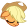
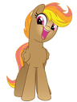
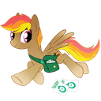
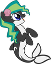
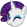
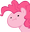

# EFNW Discord Emoji Collection

Here lies our Discord emojis!

**Disclaimer:** some of these emojis are scavenged off the web, and a source is provided when available.

| Emoji | Alias | Source |
| ----- | ----- | ------ |
|  | :alseep: |  |
|  | :awesome: |  |
|  | :blargh: |  |
|  | :blep: |  |
|  | :button: |  |
|  | :chase: |  |
|  | :cheers: |  |
|  | :coffee-1: |  |
|  | :deal: |  |
|  | :delivery: |  |
|  | :excited: |  |
|  | :facehoof: |  |
|  | :float: |  |
|  | :fly: |  |
|  | :frontpage: |  |
|  | :gasp: |  |
|  | :happy: |  |
|  | :hello: |  |
|  | :hug: |  |
|  | :huh: |  |
|  | :joy-1: |  |
|  | :laugh: |  |
|  | :lick: |  |
|  | :lookup: |  |
|  | :marina: |  |
|  | :mocha: |  |
|  | :news: |  |
|  | :nope: |  |
|  | :novella: |  |
|  | :party: |  |
|  | :rekt: |  |
|  | :report: |  |
|  | :sad: |  |
|  | :sharpie: |  |
|  | :shrug-1: |  |
|  | :sick: |  |
|  | :sit: |  |
|  | :smile-1: |  |
|  | :squee: |  |
|  | :swim: |  |
|  | :tailwhip: |  |
|  | :tales: |  |
|  | :thinking-one: |  |
|  | :wat: |  |
|  | :what: |  |
|  | :wink-1: |  |
|  | :working: |  |
|  | :write: |  |
|  | :wut: |  |
|  | :yay: |  |